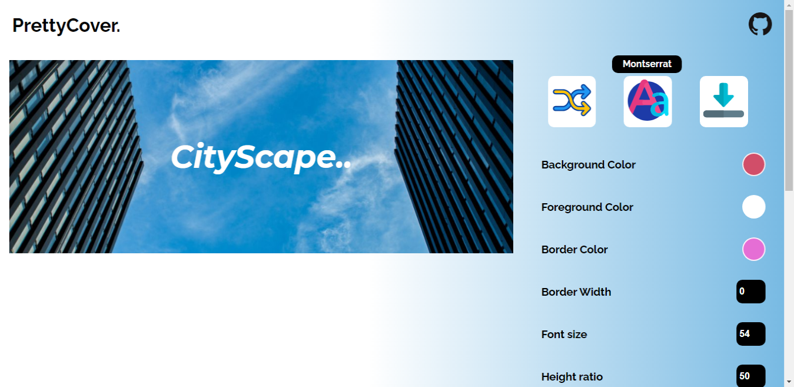

# PrettyCover   
# Create beautiful cover images for your blogs

## Features :zap:

 - Customize almost everything from Background color to Height Ratio the image. :100: 
 - Download the image after editing. :inbox_tray:   
 - Upload your own images and edit on top of them. :open_file_folder: 
 - Confused on choosing colors ? No worries, use the inbuilt **Color shuffler** to enjoy the spontaneous splash of colors. :twisted_rightwards_arrows: 
 - Choose among 5 different font-styles using the inbuilt **Font shuffler** and get creative. :arrows_counterclockwise: 

## Try it live here: https://ridhikgovind.github.io/PrettyCover/

## Tech Stack: 
 * HTML
 * CSS
 * JavaScript
